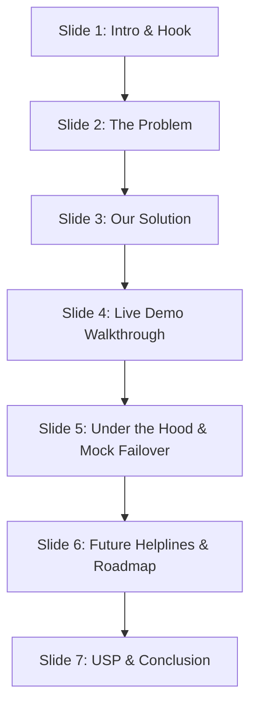

# ResQVerse: Slide-by-Slide Presentation Pitch Script
### Tailored to Currently Implemented Features for HACKVENTURE 2K26

* **Team Name:** The_CodeCrafters
* **Domain:** Open Innovation
* **College:** Vishwakarma Institute of Technology, Pune
* **Target Presentation Time:** 7 - 9 Minutes

---

## Pitch Structure Overview


---

### Slide 1: Title Slide (Introduction & Hook)
* **Visuals on Slide:**
  * Project Title: **ResQVerse: Next-Generation Emergency Mesh Network**
  * Sub-headline: *"Safety Shouldn't Depend on a Stable 5G Network"*
  * Team: **The_CodeCrafters** (Vishwakarma Institute of Technology, Pune)
  * Presenters: [Your Names]
* **Speaker Duration:** 45 seconds

#### 🎙️ Speaker Script:
> *"Good morning, respected judges and fellow innovators. We are team **The_CodeCrafters** from Vishwakarma Institute of Technology, Pune. Today, we are presenting our project, **ResQVerse**, under the Open Innovation track.
>
> Imagine you are walking home late at night through a dark street, or traveling through an unfamiliar area. Suddenly, you feel followed. Your heart races, your hands tremble. You want to call for help, but your phone is locked, your internet signal is weak, and normal apps require you to unlock, find the app, and tap through menus. In an emergency, every second counts, and current safety apps fail because they are too slow and depend entirely on a strong internet connection. 
> 
> ResQVerse is built to eliminate these barriers completely. Let us show you how."*

---

### Slide 2: The Core Problem Statement
* **Visuals on Slide:**
  * Title: **The Safety Gap in Emergencies**
  * Key Points with Icons:
    * 🛑 **The Panic Freeze:** Victims cannot physically navigate screens during high-stress encounters.
    * 📵 **Internet Blind Spots:** Parking basements, remote roads, and crowded places have zero internet data.
    * ⚠️ **False Alarm Spam:** Pocket triggers waste rescue resources without validation.
    * 👤 **Stalker Vulnerabilities:** Continuous 24/7 location tracking violates privacy and exposes users.
* **Speaker Duration:** 60 seconds

#### 🎙️ Speaker Script:
> *"During our research, we identified four massive flaws in current emergency safety solutions:
>
> First, **The Panic Freeze**: When someone is threatened, they freeze. They cannot physically unlock a phone, find a safety app, and select coordinates.
>
> Second, **Internet Blind Spots**: Emergencies don't wait for 5G coverage. If you are in a basement parking lot or a remote highway, standard safety apps fail because they require active internet data to write to the cloud.
>
> Third, **False Alarms**: Many native SOS triggers are activated by mistake in pockets, causing rescue networks to waste time.
>
> And fourth, **Privacy Concerns**: Continuous tracking apps drain battery and expose locations constantly.
>
> ResQVerse solves all of this by introducing a hands-free, offline-ready emergency node that adapts to your environment."*

---

### Slide 3: The ResQVerse Solution (What We Built)
* **Visuals on Slide:**
  * Title: **Introducing ResQVerse**
  * Columns:
    * **Dual-State SOS Hub:** Categories (Medical, Accident, Security, Fire) + 3-Second Safety Countdown.
    * **Hands-Free Speech Engine:** Real-time microphone listening for multi-language trigger words.
    * **Offline Safety Suite:** Programmatic wailing siren + cellular deep-link SMS fallback coordinates.
    * **Discreet Decoy Mode:** Hide the emergency UI behind a functioning Weather Dashboard.
* **Speaker Duration:** 75 seconds

#### 🎙️ Speaker Script:
> *"Here is what we have fully implemented and running in ResQVerse today:
>
> 1. **Our Dual-State SOS Hub:** This manages the standby and alert states. Users categorize their emergency into Medical, Accident, Security, or Fire so responders know exactly what crisis they are walking into.
> 2. **Hands-Free Speech Engine:** The app uses the browser microphone to scan for distress words in 7 languages (like 'Help', 'बचाओ', or 'मदत'). If matched, it triggers the SOS without the user ever touching the screen.
> 3. **The 3-Second Countdown Buffer:** Once triggered, a countdown starts, allowing users to cancel false alarms.
> 4. **Offline Fallback Suite:** If there's no internet, the app synthesizes a loud siren from scratch without downloading files, and compiles your GPS coordinates into a text message link ready to send over standard cellular lines.
> 5. **Discreet Screen Mask:** With one tap, the screen transforms into a normal weather app, hiding the fact that you are actively broadcasting emergency alerts from any attacker."*

---

### Slide 4: Live Demo Walkthrough (Showstopper Slide)
* **Visuals on Slide:**
  * Interactive screenshots of the App Interface (Dashboard, Decoy Weather Screen, Family Feed Alert Card).
  * *Presenter Note: Do the live demonstration steps during this slide.*
* **Speaker Duration:** 120 seconds

#### 🎙️ Demo Guide & Speaker Script:
* **Demo Action 1: On-Screen Trigger & Countdown**
  > *(Pointer: Tap the Red SOS Button)*
  > *"First, notice our clean dashboard. I will tap the SOS button under the 'Security' category. Immediately, a wailing flashing red overlay appears with a 3-second countdown. If this was a mistake, I can click 'Cancel Dispatch' to reset."*
  
* **Demo Action 2: Voice SOS (Hands-Free)**
  > *(Pointer: Enable the Voice Toggle, step back, and say clearly: "बचाओ" or "Help")*
  > *"Now, let's test the hands-free trigger. If I am being attacked and cannot touch the screen, I simply shout 'बचाओ!'. The browser captures this keyword, identifies my language context, and automatically starts the SOS countdown."*

* **Demo Action 3: The Decoy Camouflage**
  > *(Pointer: Tap the 'Discreet Screen Mask' button)*
  > *"If a user is being held against their will, they can activate the Screen Mask. As you can see, the screen instantly changes to show weather forecasts. To an outsider, it looks completely harmless, but in the background, our React engine is silently updating location coordinates."*

* **Demo Action 4: Offline SMS Fallback**
  > *(Pointer: Turn off Wi-Fi on the demo phone. Show the red banner. Tap the 'Dispatch Backup SMS' button)*
  > *"Lastly, look at the top of the screen: the red 'Offline Mode Active' banner has appeared. Without internet data, we cannot update the cloud. If I trigger the SOS now, the app compiles my coordinates and opens my phone's default text messaging app with the GPS link pre-filled. I simply tap send, and my emergency contact receives the GPS link via standard 2G network."*

---

### Slide 5: Under the Hood & Graceful Failover
* **Visuals on Slide:**
  * Architecture Diagram: Client Browser -> Geolocation & Speech APIs -> Firebase Cloud OR LocalStorage Failover.
  * Key Icons:
    * ⚛️ **React 18 & TS:** Fast state updates and strict data types.
    * 📍 **HTML5 Geolocation:** High-precision coordinates direct from device GPS.
    * 💾 **LocalStorage Database Emulator:** Local memory database if cloud credentials are absent.
* **Speaker Duration:** 60 seconds

#### 🎙️ Speaker Script:
> *"Let's talk about the technical stack that makes this work.
>
> We built ResQVerse as a Progressive Web App (PWA) using **React, TypeScript, and Tailwind CSS**. By writing directly to bare-metal browser APIs, we eliminated heavy external packages. The location is fetched using the **HTML5 Geolocation API** directly from the phone's GPS receiver, and the siren is generated using the **Web Audio API** which builds sound waves programmatically.
>
> Now, what happens if Firebase fails or credentials are not provided? We have implemented a **Mock Failover System**. At startup, our code checks for Firebase keys. If they are absent, the app automatically enables `isMockEnabled` and redirects all login, profile, and database updates to a local emulator backed by browser `localStorage`. 
>
> This ensures the application is completely crash-proof and operates seamlessly in any environment."*

---

### Slide 6: Future Helpline Mapping & Roadmap
* **Visuals on Slide:**
  * Flow diagram mapping the 4 SOS categories to public services.
  * **🚑 Medical SOS** -> Sends GPS coordinates & Blood Group to local Hospitals (108).
  * **💥 Accident SOS** -> Triggers crash logs to Highway Patrol & police.
  * **🛡️ Security SOS** -> Sends silent alerts to Police dispatch (112) & alerts nearby users.
  * **🔥 Fire SOS** -> Maps structural building parameters to Fire stations (101).
* **Speaker Duration:** 60 seconds

#### 🎙️ Speaker Script:
> *"For our future roadmap, we want to map our 4 emergency profiles directly to government and local helpline services:
>
> First, **Medical SOS** will route coordinates along with the victim's **Blood Group** directly to the nearest hospital's ambulance dispatch API, saving precious minutes before arrival.
>
> Second, **Accident SOS** will send logs to Highway Patrol. By using phone accelerometer data, future versions will auto-detect vehicle collisions.
>
> Third, **Security SOS** will route silent alerts to Police control centers and notify nearby ResQVerse users to act as volunteer responders.
>
> Fourth, **Fire SOS** will integrate directly with Fire Station dispatch maps.
>
> We will also implement a **Bluetooth Mesh Network** using Web Bluetooth API to relay alerts from phone-to-phone in crowded festivals or disaster zones when cell service is completely dead."*

---

### Slide 7: USP & Target Markets (Conclusion)
* **Visuals on Slide:**
  * USPs:
    * 1. **Zero-Tracking Standby:** Location is only recorded during active SOS (Privacy First).
    * 2. **Hardware-Level Fallback:** Programmatic sirens and SMS deep links work with zero data.
    * 3. **Bilingual Hands-Free Mode:** Voice triggers support local languages.
  * Target Segments: Corporate safety (night shifts), university campuses, elderly care, and smart city nodes.
* **Speaker Duration:** 45 seconds

#### 🎙️ Speaker Script:
> *"To conclude, ResQVerse stands out because of three unique selling points:
>
> 1. **Privacy First:** Unlike other apps, we never track your location 24/7. We only capture telemetry during an active SOS.
> 2. **True Offline Fallback:** Our siren synthesis and SMS routing ensure you are protected when the grid goes down.
> 3. **Bilingual Hands-Free Access:** We recognize distress commands in regional mother tongues.
>
> ResQVerse is a fully functional PWA, ready to scale from individual family circles to smart campuses and emergency response networks. Thank you, and we are now open to any questions."*

---

## 💡 Quick Tips for the Q&A Session

* **If asked about offline SMS:** *"Since browsers are sandboxed for safety, they cannot send SMS silently. ResQVerse opens the device's native messaging client with the phone number and GPS coordinate text already pre-filled. The user just has to tap 'Send'."*
* **If asked about how it runs without Firebase keys:** *"We wrote an environment check. If keys are missing, the app activates `mockDb.ts` which acts as a database emulator storing data in `localStorage`. It simulates real-time Firestore database snap listeners so the demo remains fully functional."*
* **If asked about battery drain from Voice recognition:** *"The microphone listener is not active by default. The user arms it manually when walking into high-risk zones, and it turns off once they mark themselves 'Safe'."*

---

## 🔄 The Complete System Flow (For Presentation Reference)

Use this step-by-step journey to explain exactly how the app executes from the moment the user opens it to the moment they are safe:

```
[1. Launch App] -> [2. Auth Check] -> [3. Grid Options] -> [4. SOS Input] -> [5. Cancel Buffer] -> [6. GPS Fetch] -> [7. Network Split]
                                                                                                                     |
                                                                                    +--------------------------------+--------------------------------+
                                                                                    | (Online)                                                        | (Offline)
                                                                                    v                                                                 v
                                                                        [8A. Firestore Write]                                             [8B. Compile SMS Payload]
                                                                                    |                                                                 |
                                                                                    v                                                                 v
                                                                        [9A. Live Feed Update]                                            [9B. Open SMS client]
                                                                                    |                                                                 |
                                                                                    +--------------------------------+--------------------------------+
                                                                                                                     v
                                                                                                        [10. Guardian Map View]
                                                                                                                     |
                                                                                                                     v
                                                                                                         [11. Mark Safe & Standby]
```

### 1. Opening & Loading the App
* **User Action:** The user taps the ResQVerse icon on their phone's home screen.
* **Under the Hood:** Because it is a Progressive Web App (PWA), browser service workers load the cached pages instantly, even in offline zones.

### 2. Log In & Profile Setup
* **User Action:** The user signs in or registers, creating their profile (Name, Phone, Blood Group) and linking their primary contact numbers (Guardian Nodes).
* **Under the Hood:** The app runs an environment check. If Firebase keys are set, it registers the user in the cloud. If Firebase keys are missing, the mock failover engine registers and saves the profile in the browser's `localStorage`.

### 3. Entering Standby Mode (Command Center)
* **User Action:** The user sees the main dashboard. It sits in **Standby Mode** (marked as "SECURE / STANDBY"). The user selects one of the 4 emergency categories:
  * 🚑 **Medical** (for medical distress)
  * 💥 **Accident** (for road collisions)
  * 🛡️ **Security** (for stalking or direct threats)
  * 🔥 **Fire** (for fire hazards)

### 4. Triggering the SOS
* **User Action:** The user triggers the SOS using one of two options:
  * **Option A (Physical):** They tap and hold the big red "SOS" button.
  * **Option B (Hands-Free Voice):** They shout a trigger phrase like `"Help!"` or `"बचाओ!"`. The browser's Speech Recognition parses the microphone audio and initiates the trigger.

### 5. Flashing Countdown Buffer
* **User Action:** A full-screen red warning overlay flashes with a 3-second timer.
* **Under the Hood:** The countdown acts as a buffer. If it was triggered by accident, the user can click **"Cancel Dispatch"** to stop the broadcast.

### 6. Geolocation Lookup
* **User Action:** The 3-second timer runs out.
* **Under the Hood:** The browser queries the device's native GPS chip via the **HTML5 Geolocation API** (with `enableHighAccuracy: true` enabled) to fetch precise latitude and longitude coordinates. The app wraps these coordinates into a Google Maps URL link.

### 7. Branching by Connectivity (Online vs. Offline)
The app checks if the device is connected to the internet:

* **Branch A: If Online (Cloud Sync Mode)**
  * **The App:** Writes the location, name, category, and battery status directly to Firebase Firestore (or the `localStorage` mock simulator).
  * **The Guardian:** The guardian's Family Dashboard runs a real-time Firestore observer listener (`onSnapshot`). It receives the update instantly, displays a flashing red emergency alert card, and rings a siren on their device.

* **Branch B: If Offline (Cellular SMS Bypass Mode)**
  * **The App:** Displays a warning button: **"📲 Dispatch Backup SMS"**.
  * **The User:** Taps the button.
  * **The App:** Automatically opens the phone's native **Messages App** with the guardian's contact number and a pre-written text containing the Google Maps coordinate link pre-filled.
  * **The User:** Taps "Send" in their SMS app. The alert travels over the 2G voice network without needing mobile data.

### 8. Guardian Rescues the Victim
* **Guardian Action:** The guardian sees the red alert card on their dashboard (online) or receives the SMS text message (offline). They click the Google Maps link, which opens native navigation directing them to drive to the victim's exact coordinates.

### 9. Resolving the Alert
* **User Action:** Once safe, the user taps **"I am Safe Now"** on their dashboard.
* **Under the Hood:** The app updates the emergency status in the database to `"Safe"`. The guardian's dashboard feed receives the update, changes the red warning card to green, silences the alerts, and returns the entire system to standby mode.

---

## 📱 Why PWA (Progressive Web App) is the Perfect Choice for ResQVerse

During your presentation, judges might ask: *"Why didn't you build a native Android/iOS app? Why a web app/PWA?"* Use these points to show why a PWA is far more reliable for safety:

### 1. Zero App Store Friction (Installed in 2 Seconds)
* **The Problem:** During a crisis, a user cannot wait to download a 60MB app from the Google Play Store or Apple App Store, enter passwords, and wait for installation.
* **The PWA Advantage:** The user simply scans a QR code or visits the URL once. They tap "Add to Home Screen" and it installs **instantly** in under 2 seconds. The installer size is negligible, bypassing app store reviews.

### 2. Offline-First Asset Loading (100% Load Reliability)
* **The Problem:** Standard websites show a blank screen or a "No Network Connection" dino error if you have no internet data.
* **The PWA Advantage:** We use a **Service Worker** to cache all core application code, CSS layouts, translation dictionaries, and icons in the browser's local sandbox storage. If the user opens the app in a basement with zero internet, it still loads and opens immediately.

### 3. Native Screen Masking (Camouflage)
* **The Problem:** Browser URL bars and navigation buttons ruin decoy camouflage dashboards.
* **The PWA Advantage:** When saved on the home screen, the app runs in **standalone display mode**. It hides the browser search bar and back buttons, mimicking a native mobile application. This allows our **Discreet Decoy Mask** to look like a real weather application.

### 4. Permanent Session Caching (Zero Login Timeout Errors)
* **The Problem:** Standard web applications log you out after a few hours or days. Re-entering credentials in an active threat is impossible.
* **The PWA Advantage:** ResQVerse caches login sessions persistently. Once registered, the user is never logged out unless they click "Sign Out". The app goes straight to the SOS console upon clicking the icon.

### 5. Universal Device Compatibility
* **The Problem:** Writing different codebases for iOS, Android, and Windows takes months and consumes heavy testing resources.
* **The PWA Advantage:** One code base runs everywhere. A victim on a cheap Android phone, a high-end iPhone, or a laptop browser can run ResQVerse and transmit GPS coordinates with the exact same reliability.


