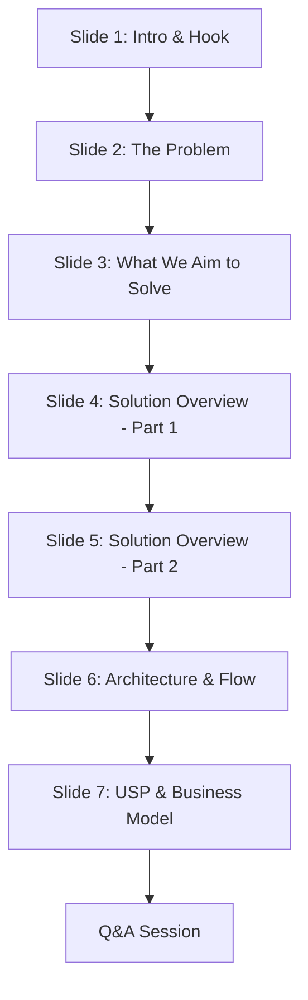

# ResQVerse: The Next-Generation Emergency Mesh Network
## Complete Presentation Kit, Script, and Technical Guide

This document contains everything you need to pitch **ResQVerse** at **HACKVENTURE 2K26**. It includes a slide-by-slide presentation script, competitor analysis, Q&A prep, technology stack explanation, and future roadmaps.

---

## Part 1: Competitor Analysis & Problem Validation

### Existing Solutions & Their Drawbacks
While safety apps exist, they suffer from critical flaws that render them ineffective during actual high-stress emergencies:

| Competitors | What They Do | Key Drawbacks & Weaknesses | ResQVerse Edge |
| :--- | :--- | :--- | :--- |
| **Life360 / Find My** | Continuous location sharing for families. | <ul><li>**No immediate emergency focus:** Primarily for general tracking, not panic response.</li><li>**No offline support:** Fails completely when internet connection is lost.</li><li>**Heavy battery drain:** Constant background GPS coordinates updates.</li></ul> | Dedicated **Dual-State SOS Hub** with 3-second quick cancellation and Offline fallback protocols. |
| **Native Device SOS (iOS/Android)** | Triggers alerts by pressing power buttons rapidly. | <ul><li>**High Rate of False Alarms:** Very easy to trigger accidentally in pocket.</li><li>**Rigid Recipient List:** Difficult to dynamically manage contact nodes.</li><li>**No telemetry feedback:** The victim has no idea if the message was received.</li></ul> | **Visual and audio telemetry validation** with real-time feedback and customizable Emergency Profiles. |
| **Traditional Panic Button Apps** | Requires launching app, finding buttons, and manually entering information. | <ul><li>**Too slow for panic situations:** If someone is being harassed, they cannot look at the screen to navigate complex menus.</li><li>**No fallback triggers:** Only works via on-screen buttons.</li></ul> | **Voice SOS Assistant** supporting multi-language speech triggers (`"Help"`, `"बचाओ"`, `"मदत"`) for hands-free activation. |

---

## Part 2: The Core Problem Statement: Why ResQVerse?

### Why This Problem?
In critical situations like harassment, accidents, or medical crises, **every second counts**. Current response systems are delayed due to:
1. **The Panic Freeze:** Victims in high-stress situations often freeze or cannot physically tap their phone screens.
2. **Network Blind Spots:** Emergencies don't wait for 5G connectivity. In basement parking lots, remote roads, or crowded festivals, internet grids fail.
3. **Information Asymmetry:** When emergency alerts go out, responders lack context. Is it a medical issue? Is it a security threat? Responders waste precious time figuring out what equipment to bring.

### What ResQVerse Solves
ResQVerse bridges these gaps by transforming a standard web application into a **Guardian Node** that can broadcast telemetry data instantly, adapt to low-connectivity zones, recognize spoken distress keywords hands-free, and coordinate response details in real-time.

---

## Part 3: Slide-by-Slide Presentation Script

This script is structured for a **7 to 9-minute pitch** at Hackventure 2K26, covering all 7 slides in your deck.



---

### Slide 1: Title Slide (Introduction)
* **Visuals on Slide:**
  * Title: **ResQVerse: The Next-Generation Emergency Mesh Network**
  * Logo: HACKVENTURE 2K26
  * Team Name: **The_CodeCrafters**
  * Domain: Open Innovation
  * College: Vishwakarma Institute of Technology, Pune
* **Estimated Duration:** 45 seconds

#### Speaker Script:
> *"Good morning, esteemed judges and fellow participants. We are team **The_CodeCrafters** from Vishwakarma Institute of Technology, Pune. Today, we are presenting our project under the Open Innovation domain: **ResQVerse: The Next-Generation Emergency Mesh Network**.*
>
> *Imagine you are walking home late at night, or traveling through an unfamiliar area, and suddenly you feel threatened or experience a medical emergency. You pull out your phone, but your hands are trembling, the signal is weak, and traditional apps require you to unlock, find an app, and tap repeatedly. That friction can cost a life. ResQVerse is built to eliminate that friction completely."*

* **Visual Cue:** If presenting on a projector, have the app open on a phone or laptop ready to show immediately after Slide 1.

---

### Slide 2: The Problem
* **Visuals on Slide:**
  * Headline: THE PROBLEM
  * Bullet Points: Delay Emergency Communication, Difficulty in Sharing Live Location, Dependence on Internet Connectivity, Complex & Non-intuitive Solutions
* **Estimated Duration:** 60 seconds

#### Speaker Script:
> *"Let's look at the harsh reality of modern emergencies. Whether it is harassment, kidnapping, physical accidents, or sudden medical crises, victims face a massive communication gap. We have identified four key problems in existing systems:*
>
> 1. *First, **Delay in Emergency Communication**: Victims struggle to send alerts during panic, causing delays in response.*
> 2. *Second, **Difficulty in Sharing Location**: Capturing high-precision GPS coordinates and sharing them manually is highly challenging under stress.*
> 3. *Third, **Dependence on Internet Connectivity**: Most modern apps fail completely in low-network zones like basement parking lots, tunnels, or rural roads.*
> 4. *And fourth, **Complex and Non-Intuitive UIs**: Safety features buried behind multiple screens are useless during an active threat.*
>
> *We realized that safety shouldn't depend on a stable 5G connection or the ability to navigate a complex app interface. That is why we built ResQVerse."*

---

### Slide 3: What We Aim to Solve
* **Visuals on Slide:**
  * Headline: WHAT WE AIM TO SOLVE
  * Bullet Points: Reduced Response Time, Instant Location, Faster Immediate Help, Improved Safety (Women/Elderly/Travelers), Reliable Communication (Offline SMS support), Stronger Support Network, Peace of Mind.
* **Estimated Duration:** 60 seconds

#### Speaker Script:
> *"ResQVerse aims to redefine safety by fundamentally shifting how emergency telemetry is collected and broadcasted.*
>
> *Here is what changes with ResQVerse:*
> * *We **reduce response times** by introducing instant one-tap triggers and voice activation.*
> * *We provide **instant access to accurate location telemetry**, bypassing app obstacles to generate shareable tracking links.*
> * *We ensure **improved safety for vulnerable groups** like women, children, and elderly citizens by offering continuous guardian monitoring.*
> * *Most importantly, we achieve **reliable communication** in offline areas. By automatically compiling telemetry data into a compact, formatted SMS payload, ResQVerse ensures that even if you have zero internet, your coordinates are transmitted to your emergency contacts.*
> * *This creates a stronger emergency support network, giving loved ones real-time updates and ultimate peace of mind."*

---

### Slide 4: Solution Overview - Part 1
* **Visuals on Slide:**
  * Three columns:
    * **Dual-State Emergency SOS Hub** (Emergency categories, 3-sec countdown, Live Emergency Dashboard, Safe Check-in)
    * **Women's Safety & Offline Support** (Browser Panic Siren, Decoy Screen Mode, Offline SMS Backup, Works without internet)
    * **Voice SOS Assistant** (Hands-free activation, Multi-language voice triggers, Offline speech recognition)
* **Estimated Duration:** 90 seconds

#### Speaker Script:
> *"Our solution is divided into three core pillars:*
>
> * **Pillar 1 is our Dual-State Emergency SOS Hub**: It allows users to classify their emergencies into Medical, Accident, Security, or Fire. Once tapped, a 3-second safety countdown is triggered to prevent false alerts. When active, it unlocks a live emergency telemetry dashboard.*
>
> * **Pillar 2 is our Women's Safety & Offline Suite**: This includes a **Browser-based Panic Siren** which utilizes the Web Audio API to synthesize a high-frequency alarm directly from the browser speakers to deter attackers. It also features a **Decoy Screen Mode** or *Discreet Screen Mask* which disguises the screen as a normal weather app while secretly keeping the SOS coordinates active in the background. In offline environments, the app dynamically changes its configuration to compile coordinates into a single click-to-send SMS payload.*
>
> * **Pillar 3 is our Voice SOS Assistant**: Using hands-free Speech Recognition, a user can shout distress keywords in English, Hindi, Marathi, Spanish, French, or Tamil—such as `'Help'`, `'बचाओ'`, `'मदत'`, or `'Notfall'`. The app detects these phrases and automatically initiates the SOS sequence without requiring any physical touch.*

* **Visual Cue:** This is the perfect moment to do a quick **Live Demo**.
  * **Demo Step 1:** Turn on the Voice SOS trigger, shout "बचाओ" (or "Help"), and watch the 3-second countdown automatically initiate.
  * **Demo Step 2:** Click the "Discreet Screen Mask" button to show the fake weather disguise.
  * **Demo Step 3:** Toggle the siren button to play the harsh, oscillating audio synthesized in the browser.

---

### Slide 5: Solution Overview - Part 2
* **Visuals on Slide:**
  * Three columns:
    * **Real-Time Family Alerts** (Family alerts, Live location sharing, Battery & GPS monitoring, Responder dashboard)
    * **Incident History & Maps** (Emergency timeline, GPS coordinates, One-click Google Maps navigation, Telemetry records)
    * **Multi-Language Accessibility** (English, Hindi, Marathi, Tamil, German, French, Spanish)
* **Estimated Duration:** 60 seconds

#### Speaker Script:
> *"Continuing our solution details, let's explore how the recipient side operates and how accessibility is maximized.*
>
> *First, we have **Real-Time Family Alerts**. The moment an SOS is triggered, a live telemetry transmission starts. This sends details on battery level, simulated network diagnostics, and GPS precision, which are displayed on the Guardian's dashboard.*
>
> *Second, we have **Incident History & Maps**. ResQVerse keeps an emergency timeline log. This allows contacts to check past incidents, retrieve exact coordinates, and launch one-click Google Maps navigation to drive directly to the victim’s location.*
>
> *Third, we focus on **Multi-Language Accessibility**. Safety shouldn't have a language barrier. Our interface and Voice SOS triggers adapt dynamically to **English, Hindi, Marathi, Tamil, German, French, and Spanish**, allowing users to speak naturally in their mother tongue when calling for rescue."*

---

### Slide 6: Architecture / Flow Diagram
* **Visuals on Slide:**
  * Technical flow chart tracking user action to Firebase Firestore and real-time Family Dashboard updating via snapshots.
* **Estimated Duration:** 75 seconds

#### Speaker Script:
> *"Let's look under the hood at the technical architecture of ResQVerse.*
>
> *The application is built using **React, TypeScript, and Tailwind CSS**, compiled with **Vite** for lightning-fast loading as a Progressive Web App (PWA). This ensures the app is cross-platform, running on both mobile and desktop browsers.*
>
> 1. *When a user registers and logs in, their profile and emergency contacts (Guardian Nodes) are authenticated using **Firebase Auth**.*
> 2. *When an SOS is activated, the app utilizes the **HTML5 Geolocation API** to acquire high-precision GPS coordinates, which are converted into a shareable Google Maps URL.*
> 3. *This payload is written instantly to our **Firebase Firestore** NoSQL database.*
> 4. *On the guardian's end, the **Family Dashboard** runs a real-time Firestore listener using `onSnapshot`. Within milliseconds, the guardian’s feed updates with the victim's name, distress category, live coordinates, and a navigation button.*
>
> *In case internet connectivity is unavailable, the app bypasses Firestore and generates a native cellular SMS link (`sms:contacts?body=coordinates`) so the user can send their precise telemetry via standard cellular networks."*

---

### Slide 7: USP & Business Model
* **Visuals on Slide:**
  * Left: USPs (Women's Safety/Offline Suite, Bilingual Hands-Free Voice SOS, Real-Time Guardian Mesh Feed, Incident History, Multi-language support)
  * Right: Target Markets (Individual & Family, Educational Institutions, Government & Smart Cities, Corporate Safety, Emergency Services & NGOs)
* **Estimated Duration:** 90 seconds

#### Speaker Script:
> *"Now, let's discuss our Unique Selling Propositions and our Business and Deployment Model.*
>
> *Our **USPs** set us apart from any basic safety app:*
> * *Our browser-native panic siren and offline SMS backup provide an unmatched **Offline Safety Suite**.*
> * *Our **Bilingual Speech Engine** allows voice-activated SOS triggers completely offline.*
> * *We provide **Full Telemetry** (including the sender's battery percentage and GPS precision values) to verify and coordinate the rescue.*
>
> *For our **Business and Deployment Model**, we have designed ResQVerse to scale across five distinct sectors:*
> 1. * **Individual & Family Users (B2C)**: A freemium subscription for continuous guardian monitoring and customized SOS rules.*
> 2. * **Educational Institutions (B2B)**: Providing universities and schools with a 'Campus Safety Dashboard' to monitor student distress alerts within campuses.*
> 3. * **Government & Smart Cities**: Integrating emergency signals directly with municipal control centers and public safety dashboards.*
> 4. * **Corporate Safety**: B2B enterprise dashboard for employee tracking, particularly during late-night shifts or travel.*
> 5. * **Emergency Services & NGOs**: Open APIs for volunteer networks, allowing real-time emergency broadcast relays to local nearby rescuers.*
>
> *This shows that ResQVerse is not just a demo project, but a highly scalable, multi-faceted platform ready for commercial and social impact."*

---

## Part 4: Comprehensive Q&A Preparation (Judges' Questions)

### Q1: "You mentioned this is a PWA/Web App. How can a web app send an SMS offline when cellular data is completely gone?"
* **Answer:**
  > *"Since standard browsers cannot send cellular messages due to security sandboxing, ResQVerse leverages native protocol handlers using deep-linking. We construct a structured URL schema using the `sms:` protocol, populated with the primary contact's phone number and a pre-formatted message body containing the GPS coordinates. When the offline trigger is clicked, it instantly opens the device's native SMS application with the pre-filled coordinates. The user just has to tap send, ensuring telemetry transmission even with zero internet."*

### Q2: "Web Speech Recognition usually requires an internet connection on some browsers. How does Voice SOS work offline?"
* **Answer:**
  > *"The Web Speech API relies on the browser's underlying operating system engine. On modern devices (Android, iOS, Chrome on Windows/macOS), speech recognition engines support local language packs which run completely offline on-device. If the browser does not support offline speech API, the system automatically falls back to our physical UI touch trigger, notifying the user via the Node Diagnostics dashboard of the current capability status."*

### Q3: "How do you prevent false voice triggers if someone just says the word 'help' in normal conversation?"
* **Answer:**
  > *"To mitigate false triggers, we implement two core defenses. First, the Voice SOS trigger is not active by default; the user toggles it on when entering high-risk environments (e.g., walking through a dark street). Second, when a distress keyword is recognized, it does not immediately broadcast the alert. Instead, it triggers a **3-second warning countdown** with a loud visual overlay and audio cue. This gives the user ample time to tap 'Cancel Dispatch' if it was a false trigger."*

### Q4: "How does the siren play audio without downloading audio files, especially in offline scenarios?"
* **Answer:**
  > *"We do not use pre-recorded audio files. Instead, we use the **Web Audio API** to generate sound waves programmatically in real-time. We configure a primary oscillator using a `sawtooth` wave at 800Hz to create a harsh, piercing tone. We then connect a Low-Frequency Oscillator (LFO) set to `sine` at 2.5Hz to modulate the primary oscillator's frequency up and down. This mimics a real emergency vehicle siren and functions completely offline because the sound is synthesized directly by the browser's audio processor."*

### Q5: "Firestore is a centralized cloud database. How does your app fit the 'Mesh Network' title?"
* **Answer:**
  > *"In our current architecture phase, client devices act as local network nodes that update a shared real-time ledger in Firestore. However, the system is designed to transition to a true peer-to-peer mesh. By packaging the app as a Progressive Web App (PWA), we are ready to implement **WebRTC and Web Bluetooth APIs** in Phase 2. This will allow nearby nodes to relay emergency telemetry packets hop-by-hop from device to device until a node with internet connectivity is reached, bypassing central servers entirely in disasters."*

### Q6: "If Firebase fails to initialize or the keys are missing, does the entire app crash?"
* **Answer:**
  > *"No, we have built a robust **Mock Database Fallback Mode**. During startup, our Firebase service module checks for the presence of valid configuration keys. If keys are missing or initialization fails due to network blocking, the app automatically switches to Demo Mode using a simulated database (`mockDb.ts`). This allows us to demonstrate all real-time functionalities, including the Family Dashboard and location radar, in sandbox environments without breaking the application UI."*

### Q7: "What happens if a child plays with the phone or a user taps the SOS button by mistake? Isn't that misuse?"
* **Answer:**
  > *"We have tackled the misuse and false trigger problem with a three-layer defensive design:*
  > 1. * **3-Second Countdown and Cancellation:** Whenever the SOS button is tapped (or a voice distress keyword is detected), the app enters a loud, highly visible 3-second countdown state. During this window, a 'Cancel Dispatch' button is active. If triggered by accident, the user can easily abort the broadcast before any data is sent to Firestore.*
  > 2. * **The 'I am Safe Now' Reset:** If the alert goes through, the victim can tap the 'I am Safe Now' button to update the status to 'Safe' instantly, resolving the emergency across all guardian screens and stopping sirens.*
  > 3. * **Contact Verification Protocol:** In a real deployment, alerts are sent directly to designated family members (Guardian Nodes) who know the user, rather than public rescue centers immediately. The family dashboard displays device telemetry (e.g., if the user's battery is high, location is static, and they mark safe, the family can quickly call to check if it was an accidental tap), preventing the waste of public rescue resources."*

### Q8: "Your demo is a website. In a critical emergency, how is a user supposed to open a browser, type a URL, log in, and press SOS? It's too slow and unrealistic."
* **Answer:**
  > *"That is a very practical concern, and we solved it by building ResQVerse as a **Progressive Web App (PWA)**, rather than a standard static website.*
  > 1. * **Zero-Install 'Add to Home Screen':** When a user first visits the web URL, they are prompted to save it. This installs a native launcher icon on their phone's home screen. The app opens instantly in a fullscreen standalone window, bypassing the browser URL bar.*
  > 2. * **Persistent Authentication Session:** Users log in once during onboarding. Firebase Auth keeps the session persistently active, so the user never needs to log in again in an emergency.*
  > 3. * **Voice Activation and OS Integration:** Since the PWA is installed, users can configure voice triggers or mobile widgets to launch the app instantly. Once open, our Hands-Free Voice Engine handles the rest. They don't need to touch the screen at all—they just scream for help."*

### Q9: "What exactly do you mean by 'Offline' functionality in a web app, and how does the offline mode protect the user?"
* **Answer:**
  > *"When we say 'Offline', we mean that the entire core safety suite runs locally in the client’s browser without depending on an active internet data connection. We achieve this through:*
  > 1. * **PWA Service Worker Caching:** Once opened online, the service worker caches all Javascript, CSS, translations, and pages. If network connection is lost, the app still loads and works offline.*
  > 2. * **On-Device Web Audio Synthesis:** The Panic Siren is synthesized programmatically on the fly from the device’s local hardware sound cards. It requires 0kb of audio download.*
  > 3. * **Native SMS Protocol Fallbacks:** If the device has no internet connection, the app automatically switches modes. Clicking the trigger converts the GPS telemetry into a pre-compiled, structured text message containing the raw coordinates. It opens the device's native cellular SMS client. Since standard SMS travels over voice bands instead of data bands, it succeeds even in deep 2G/no-data coverage zones."*

### Q10: "Who is the primary targeted audience for ResQVerse?"
* **Answer:**
  > *"Our primary target audience is divided into consumer and enterprise segments:*
  > * **Direct Consumers (B2C):** High-risk demographics including women traveling alone, late-night shift workers, college students, elderly citizens needing medical dispatch, and outdoor travelers moving through low-signal regions.*
  > * **Enterprise & Institutional (B2B):** Universities looking to protect students on campus (Campus Safety Feed), corporate companies with late-night shifts (e.g., BPO/IT centers), and municipal smart cities aiming to integrate public safety alert terminals."*

---

## Part 5: Elite Judge Q&A: Advanced Technical Deep Dive (New Section)

These questions target architectural patterns, scaling bottlenecks, security vulnerabilities, and system limitations that a senior developer or technical judge will raise.

### Q11: "Safety applications are prime targets for stalking. If a stalker obtains access to the family member's account, how do you prevent them from tracking the victim continuously?"
* **Answer:**
  > *"We prevent user tracking abuse using two mechanisms:*
  > 1. * **Transient SOS State:** ResQVerse is not an active tracking app like Find My or Life360. We do not continuously upload GPS locations during normal operation. Coordinates are only uploaded to Firestore when an SOS is actively triggered. In standby mode, no tracking coordinates are sent.*
  > 2. * **Bilateral Authorization & Revocation:** A guardian contact cannot just search and add any user. The connection requires mutual authorization. Furthermore, the victim can revoke a contact node instantly from their profile page, cutting off their access to past telemetry logs."*

### Q12: "If the GPS signal is blocked, or the accuracy goes down to ±100 meters, how does the system ensure the responder can find the victim?"
* **Answer:**
  > *"We solve GPS degradation using a **Multi-Source Telemetry Packet**:*
  > * Along with raw latitude and longitude, our Geolocation API captures and transmits the **Accuracy Radius** in meters (displayed on the diagnostics dashboard).
  > * If the accuracy is poor, the system appends the last-known high-accuracy coordinate cache to the dispatch log, along with the device's battery rate.
  > * In our future scope, nearby peer nodes running the PWA can calculate relative RSSI (Received Signal Strength Indication) via Bluetooth Low Energy (BLE) to perform trilateration, pinpointing the victim inside structures where GPS is blocked."*

### Q13: "Active Firestore listeners (`onSnapshot`) and real-time writes scale poorly and can become expensive. How do you scale this for millions of users?"
* **Answer:**
  > *"Scaling real-time Firestore listeners requires optimizing our read/write queries:*
  > 1. * **Geohash Bounding Box Queries:** Instead of listening to the entire database or searching randomly, we group users by local geohash grids. The family dashboard only listens to updates in specific geohashes matching their linked guardian nodes.*
  > 2. * **WebSocket / Redis Cluster Hybrid:** At commercial scale, we would migrate from Firestore snapshots to an active node cluster using **WebSockets with Redis Pub/Sub**. Active clients connect via a persistent socket. Real-time updates are pushed to connected sockets, using Firestore purely as a cold-storage transactional log for resolved incidents."*

### Q14: "Keeping the microphone active for voice-activated SOS triggers will drain mobile battery rapidly. How does ResQVerse handle power budget management?"
* **Answer:**
  > *"Continuous speech recognition is indeed a power-intensive task. To optimize battery efficiency, we implement three protocols:*
  > 1. * **Dynamic Duty Cycling:** The microphone scanning is not running 24/7. It is manually armed by the user via the dashboard toggle when entering high-risk zones and turns off automatically when marked 'Safe'.*
  > 2. * **Low Power Standby Mode:** If the device's battery falls below a critical threshold (e.g., 20%), the Web Battery API triggers a handler that automatically deactivates voice recognition and defaults back to the low-power physical touch button, preserving device battery life for emergency GPS coordinate broadcasts."*

### Q15: "Since you transmit location over Firebase, what happens if your Firebase Firestore database is compromised? Stalkers could read live locations of all active victims."
* **Answer:**
  > *"To protect against server-side compromises, we plan to implement **Zero-Knowledge End-to-End Encryption (E2EE)** using the browser's native **Web Crypto API**:*
  > * When a user links with their guardian contacts, they exchange public keys out-of-band or via a secure handshake.
  > * When an SOS is triggered, the location coordinates are encrypted locally on the device with the guardian's public key *before* being sent to Firestore.
  > * Firebase only stores an encrypted cipher string. Even if the database is breached, the attacker cannot read the coordinates. Only the recipient guardian holding the corresponding private key can decrypt and open the location in Google Maps."*

### Q16: "What happens if a user triggers an SOS offline, saves the logs locally, and then connects back online? How do you merge and sync the emergency logs?"
* **Answer:**
  > *"To handle network transitions, we leverage **Firestore Offline Persistence** and local **IndexedDB caching**:*
  > * If the network drops during an SOS, Firestore's offline cache automatically intercepts the write operation and saves it locally in the browser’s storage.
  > * The moment the service worker detects a transition back to an online state (using browser `online` events), it synchronizes the local cache with the remote database.
  > * To handle conflicts, the database uses server-side timestamps. Since emergency updates are additions to a historical record rather than modifications of old files, they append to the timeline logs sequentially, preventing sync conflicts."*

---

## Part 6: Hackathon Winning Strategies & Presentation Aesthetics

To stand out among hundreds of projects and win the "Open Innovation" domain, you must show polish and advanced execution. Follow these strategies:

### 1. Choreograph a High-Impact "Showstopper" Live Demo
Do not just click buttons. Create a narrative:
* **The Setup:** Open the web app on a mobile device and show it is running. Explicitly show the dashboard.
* **The Voice Trigger:** Arm the Voice SOS. Step back from the computer, and shout *"Help! बचाओ!"* in a panicked tone. Let the judges see the 3-second red overlay start flashing without you touching the device.
* **The Offline Proof:** Turn off the Wi-Fi on the demo phone. Click the "Offline SMS" button. Show the judges the screen transition: it instantly opens the native SMS client, pre-populated with a coordinate link like `https://google.com/maps?q=18.468,73.863` and the primary contact's phone number. This proves it functions without cellular data.
* **The Discreet Mode Demonstration:** Activate the "Discreet Screen Mask". Walk up to the judges and show them the screen. It looks like a normal, boring weather forecast page. Press "Return to Command Center" to show the real telemetry dashboard is still tracking everything.

### 2. Emphasize "Tech Stack Mastery"
Judges love projects that use browser APIs directly instead of bloating the app with heavy libraries. Explicitly tell the judges:
> *"Instead of importing massive NPM libraries, we optimized ResQVerse by writing directly to the browser's bare-metal APIs: **HTML5 Geolocation API** for coordinates, **Web Speech API** for multi-language offline voice recognition, **Web Audio API** for direct hardware audio synthesis, and **Web Battery API** to dynamically scale power modes. This keeps our Progressive Web App payload under 2MB, allowing it to load in milliseconds even on poor 2G networks."*

### 3. Talk About Security and Privacy
Safety apps that share location are often called privacy risks. Address this proactively:
> *"Unlike other safety apps that track your location 24/7 and sell your data, ResQVerse is built on a **Zero-Tracking Standby** model. We do not track users until they explicitly choose to broadcast an emergency. Your privacy is protected by design."*

---

## Part 7: Technical Details & Project Architecture

### Project File Structure
```
ResQVerse/
├── src/
│   ├── components/            # Reusable UI components
│   │   ├── Button.tsx         # Sleek, animated custom button
│   │   ├── Input.tsx          # Consistent glassmorphic input styling
│   │   ├── Navbar.tsx         # Multi-language responsive navigation
│   │   └── OfflineBanner.tsx  # Dynamic network connection banner
│   ├── context/               # Global state providers
│   │   ├── AuthContext.tsx       # Firebase Authentication state
│   │   ├── EmergencyContext.tsx  # Geolocation & SOS broadcast pipeline
│   │   ├── LanguageContext.tsx   # Multi-language translation engine
│   │   ├── ThemeContext.tsx      # Dark/Light mode switcher
│   │   └── ToastContext.tsx      # Real-time alert notifications
│   ├── pages/                 # Routing pages
│   │   ├── Landing.tsx           # Product showcase & features
│   │   ├── Dashboard.tsx         # Command Center (SOS buttons, Siren, Voice)
│   │   ├── FamilyDashboard.tsx   # Real-time monitoring feed
│   │   ├── EmergencyHistory.tsx  # Timeline logs of past emergencies
│   │   └── Profile.tsx           # Contact nodes & medical info settings
│   ├── services/              # API connections
│   │   ├── firebase.ts           # Firebase SDK setup & initialization checks
│   │   └── mockDb.ts             # Demo database for sandboxed simulation
│   ├── App.tsx                # Main router & layout structure
│   └── main.tsx               # DOM insertion point
```

### Why This Tech Stack?
1. **React & Vite:** Vite provides hot-module reloading and rapid build times. React's component architecture makes updating complex UI grids (like live telemetry) easy and clean.
2. **TypeScript:** Enforces strict type safety for emergency data structures (`EmergencyRecord`), reducing runtime crashes during live pitches.
3. **Tailwind CSS:** Allows us to build a premium, custom user interface with high-end glassmorphism and animations (`animate-pulse-fast`, `animate-ping`, `glass-panel`).
4. **Firebase Firestore:** Its NoSQL structure handles unstructured emergency packets. The Web SDK's native `onSnapshot` listener enables real-time synchronization between the victim's device and the family dashboard with minimal code overhead.

---

## Part 8: Future Roadmaps

During your presentation, dedicate **30-45 seconds** to the future roadmap of ResQVerse. This shows the judges you are thinking beyond the hackathon:

1. **Bluetooth Mesh Relay (Web Bluetooth API):**
   * Relay SOS packets peer-to-peer from phone-to-phone without mobile network connectivity in dense crowds or natural disasters.
2. **AI Stress-Level Voice Analysis:**
   * Integrate a local TensorFlow.js model to analyze voice acoustics. If the user shouts in panic, detect stress levels automatically rather than relying purely on exact keyword matching.
3. **Encrypted Websocket Police Bridge:**
   * Create direct websocket tunnels to public safety answering points (PSAPs) to instantly file official emergency reports.
4. **Decoy Screen Enhancements:**
   * Expand the Discreet Screen Mask to simulate a fully interactive mini-game or news feed so a hostile presence remains completely unaware that location tracking is running.
5. **Wearable Hardware Integrations:**
   * Link with smartwatches via Web Bluetooth to trigger SOS alerts through physical gestures or abnormal heart rate spikes.
